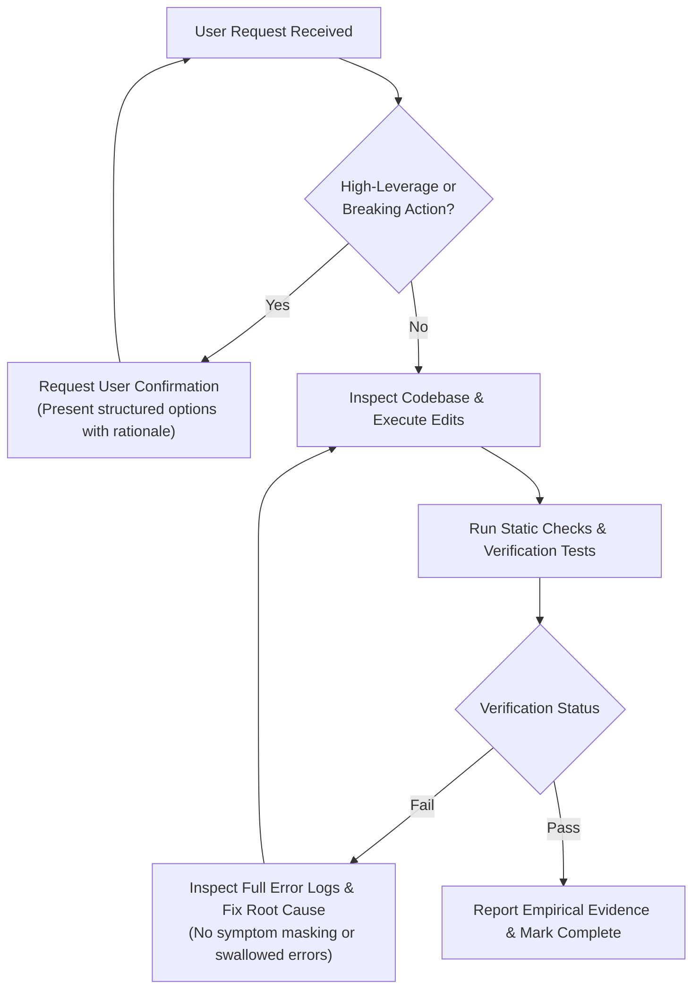

# Rule: Intent Fidelity & Empirical Verification

This rule defines non-negotiable standards for user confirmation (Fidelity Gating) and empirical runtime proof (Verification Gates) during task execution.

## 1. Intent Fidelity & Confirmation Gating

Before executing high-leverage, ambiguous, or destructive actions, enforce strict intent fidelity:

### Inspect Authority & Respect Bounds
- **Zero Assumptions**: Inspect authoritative source code, schemas, and configurations first. Never guess variable names, API signatures, or schema layouts.
- **Enforce Precise Directives**: Enforce user-defined quantitative bounds, layout limits, and structural choices without alteration.

### Approval Gating for High-Leverage Actions
Halt and request explicit user approval before executing any of the following:
- Modifying core database schemas, migrations, or production data stores.
- Destructive git or filesystem operations (force-pushing, dropping database tables, deleting non-scratch files).
- Performing cross-module breaking architectural refactors.
- Triggering billable external API calls or production network deployments.

### Structured Clarification Format
When resolving ambiguous requirements or seeking user decisions:
- Present structured, enumerated options.
- Prefix the preferred path with `(Recommended)`.
- Include a concise summary of trade-offs, risks, and rationale for each option.

## 2. Empirical Verification & Evidence Collection

Code modifications do **NOT** constitute task completion. You must gather concrete runtime proof demonstrating clean execution before marking work done.

### Non-Negotiable Verification Rules
- **No Execution = No Success**: Never claim a bug is fixed, a refactor is complete, or a feature works without running verification commands.
- **Log-First Diagnostics**: On any failure, fetch and inspect the full, un-truncated error log or traceback before forming diagnostic hypotheses.
- **Root-Cause Remediation**: Never mask symptoms, swallow exceptions, return dummy fallbacks, comment out failing assertions, or delete broken tests. Fix the underlying root cause.
- **Explicit Failure Handling**: Acknowledge non-zero command exit codes immediately and continue debugging until clean resolution is achieved.

### Verification Checklist
- [ ] **Static Analysis & Compilation**:
  - Python: `ruff check`, `mypy`, or `python3 -m py_compile <files>`
  - Shell / PKGBUILD: `shellcheck <script.sh>` or `shfmt -i 4 -w <script.sh>`
  - TypeScript / Node: `tsc --noEmit` or `bun test`
- [ ] **Runtime & Service Health**:
  - Run suite tests (`pytest`, `npm test`, `cargo test`).
  - For daemons or RPC/REST services, probe endpoints (`curl -f http://localhost:<port>/health`) or inspect active process logs (`journalctl`).
- [ ] **Empirical Evidence Output**:
  - Present the exact command executed, exit code, and key output snippet verifying success.

## 3. Execution Control Flow

