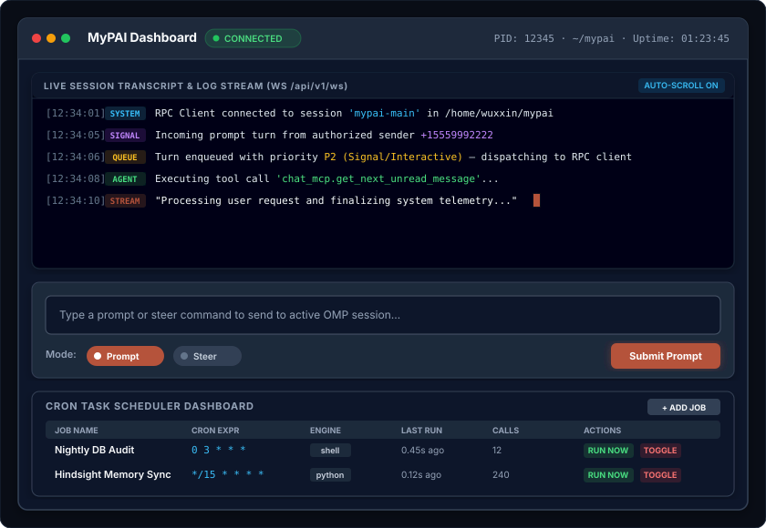

# MyPAI Embedded Single-Page WebUI Specification (`web-ui-spec.md`)

## Executive Summary

`mypai_daemon` embeds a responsive, dark-mode **Glassmorphism Single-Page Application (SPA)** served directly by FastAPI at `/` or `/ui`. It requires **zero Node.js build pipeline** at runtime and connects to `mypai_daemon` via HTTP REST (`/api/v1`) and WebSockets (`/api/v1/ws`).

---

## 1. User Interface Layout & Components

> 💡 *Interactive / Standalone HTML version available at [`webui-layout.html`](webui-layout.html).*

---

## 2. Component Specifications

### 2.1 Header & Status Indicator
- Displays real-time daemon state: `CONNECTED` (green pulsing dot), `BUSY` (amber dot), or `DISCONNECTED` (red dot).
- Shows active process PID, target workspace path, and uptime counter.

### 2.2 Transcript & Log Stream
- Subscribes to `WS /api/v1/ws`.
- Automatically appends log lines, agent response tokens, turn completions, and system notifications.
- Supports auto-scrolling with manual pause control.

### 2.3 Interactive Control Line
- **Input Textarea**: Allows human operator to type prompts directly into the active `omp` session.
- **Mode Selector**:
  - `prompt`: Submits standard turn (`POST /api/v1/session/prompt`).
  - `steer`: Submits high-priority interrupt (`POST /api/v1/session/steer`).

### 2.4 Cron Manager Panel
- Queries `GET /api/v1/cron/jobs` on load.
- Provides one-click action buttons:
  - **Run Now**: Calls `POST /api/v1/cron/jobs/run_once`.
  - **Toggle**: Calls `/enable` or `/disable`.
  - **Delete**: Calls `DELETE /api/v1/cron/jobs/{id}`.
- Includes a modal form for registering new cron tasks (`cron_add_job`).
