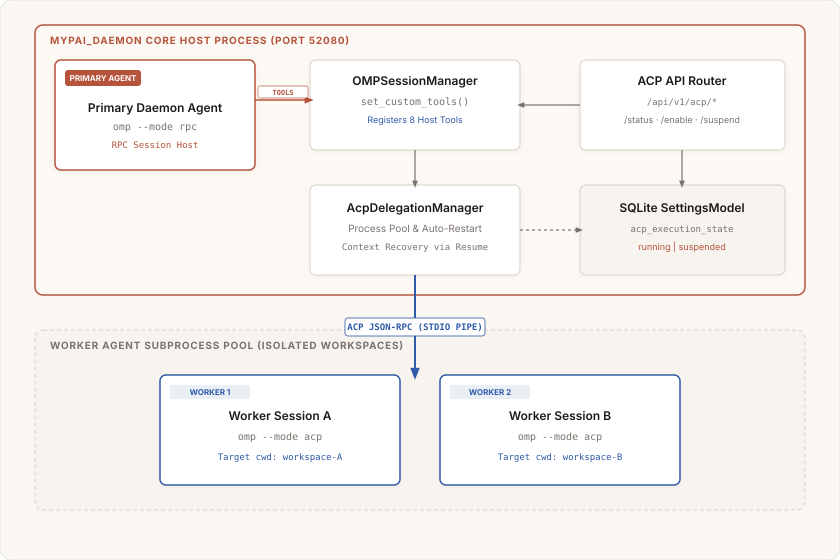

# ACP Intra-Agent Tool Specification (`acp-tool-spec.md`)

This document details the architectural specification for **ACP (Agent Control Protocol)** intra-agent task delegation engine, SQLite state management, custom host tools, and REST API endpoints in `mypai_tools.acp` and `mypai_daemon`.

---

---

The ACP tool task delegation system enables a primary `mypai_daemon` agent (`omp --mode rpc`) to delegate tasks to isolated sub-processes (`omp --mode acp`) running in target workspace directories.

---

## 2. Injected Subagent Host Tools (`mypai_tools.acp.tools`)

The 8 custom host tools registered into `omp_rpc.RpcClient` via `set_custom_tools()` provide 1-to-1 parity with native subagent task delegation:

| Host Tool Name | Parameter Schema | Description & Functionality |
| :--- | :--- | :--- |
| **`acp_task`** | `cwd: str, prompt: str, agent_profile: str = "", mode: str = "default"` | Delegates task synchronously to an ACP worker process in `cwd` and returns final text. |
| **`acp_task_async`** | `cwd: str, prompt: str, agent_profile: str = ""` | Dispatches asynchronous background task turn and returns `task_id`. |
| **`acp_task_status`** | `task_id: str = ""` | Checks status, progress, and telemetry of running or completed ACP tasks. |
| **`acp_task_result`** | `task_id: str` | Retrieves final output result for a completed `task_id`. |
| **`acp_task_steer`** | `task_id: str, guidance: str` | Injects mid-turn guidance into a running ACP worker turn. |
| **`acp_task_cancel`** | `task_id: str` | Aborts/cancels an active ACP worker task. |
| **`acp_list_agents`** | *(none)* | Lists active ACP worker processes, workspace directories, and session PIDs. |
| **`acp_inspect_session`**| `session_id: str` | Inspects transcript history for a target ACP session ID. |

---

## 3. SQLite State Persistence & REST Control API

### State Management (`AcpState`)
* Key name: `"acp_execution_state"` saved in `SettingsModel` (SQLite).
* Values: `"running"` (default) or `"suspended"`.
* When state is `"suspended"`, all 8 `@host_tool` functions return a clean error:
  `{"status": "error", "error": "ACP delegation is currently suspended in daemon settings."}`.

### REST API Endpoints (`mypai_tools.daemon.api.acp_router`)

* **`GET /api/v1/acp/status`**
  - **Description**: Get current state (`running` vs `suspended`), active worker child PIDs, task queue depth, and memory telemetry.
  - **Response (HTTP 200)**: `{"state": "running", "running": true, "suspended": false, "active_workers": 1, "workers": [...]}`

* **`POST /api/v1/acp/enable`**
  - **Description**: Enable ACP execution state in SQLite settings and broadcast WebSocket event `acp_state_changed`.
  - **Response (HTTP 200)**: `{"state": "running", "running": true, "suspended": false}`

* **`POST /api/v1/acp/suspend`** (also `/disable`)
  - **Description**: Suspend ACP execution state in SQLite settings and broadcast WebSocket event `acp_state_changed`.
  - **Response (HTTP 200)**: `{"state": "suspended", "running": false, "suspended": true}`

---

## 4. Resilience, Process Recovery & Error Handling

* **Crash Detection**: `AcpClientSession` monitors process PIDs and stdio pipes. If an `omp --mode acp` worker crashes, `AcpDelegationManager` marks the pending `task_id` as `failed` with the error trace.
* **Auto-Restart**: Subsequent calls to `acp_task(cwd, prompt)` for a crashed worker automatically re-spawn `omp --mode acp` in `cwd`.
* **State Recovery**: The re-spawned worker issues `session/load` or `session/resume` using the saved session UUID from `.omp/sessions/*.json`, restoring context transparently.
