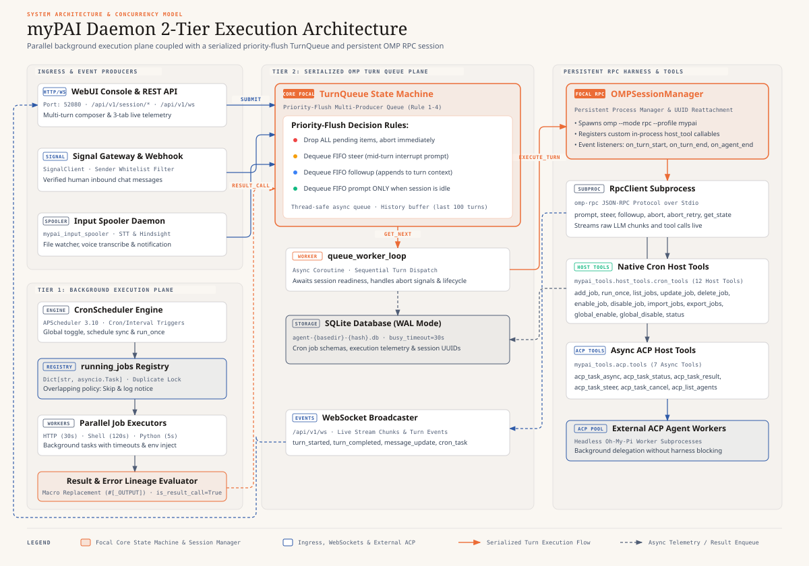

# MyPAI Daemon Core Architecture Specification (`daemon-spec.md`)

## Executive Summary

The **MyPAI Daemon** (`mypai_tools.daemon`) is the central background coordinator, RPC session manager, and input serialization gateway for **MyPAI**. It refactors the legacy `heartbeat` process into a unified, high-performance asynchronous daemon running a **FastAPI** web server and **APScheduler** engine on port `52080`.

It maintains a persistent `omp --mode rpc --auto-approve --continue` connection to a single active session in a workspace directory (`workdir`) and serializes all incoming prompts from Signal webhooks, Input Spooler sidecars, FastMCP toolcalls (`cron_mcp`), scheduled Cron tasks, and an embedded WebUI.

---

## 1. System Architecture & Component Diagram



> 💡 *Interactive / Standalone HTML version available at [`daemon-architecture.html`](daemon-architecture.html).*

---

## 2. Core Subsystems & Mechanisms

### 2.1 Prioritized Event Queue & Turn Serializer (`mypai_daemon.queue`)
* **Pattern**: Multi-Producer, Single-Consumer (MPSC) `asyncio.Queue`.
* **Purpose**: Prevents prompt turn interleaving and RPC socket locks when multiple events arrive simultaneously.
* **Priority Order**:
  1. `steer` & `abort_and_prompt` (High-priority user interrupt / abort).
  2. `webui` & `signal` (Interactive human turns).
  3. `cron` & `spooler` (Background automated tasks).

### 2.2 OMP Session Manager (`mypai_daemon.session_manager`)
* **RPC SDK**: Wraps `omp_rpc.RpcClient`.
* **Read-Only Profile Attribute**: Exposes `@property def profile(self) -> str:` as a read-only property returning `os.getenv("OMP_PROFILE", "mypai")`.
* **Session UUID Persistence & Reattachment**: Reads `session_uuid` from SQLite DB `project_settings` table. Reattaches to existing session via `--profile <profile> --resume <session_uuid>` or creates a new session, storing `session_uuid` in DB.
* **Session Title**: Automatically sets session display name to `"mypai_daemon - running"`.
* **Process Recovery**: Monitors PID via `proc.poll()`. On crash or broken pipe, cleans up handles and automatically re-instantiates `RpcClient` with session UUID in `MYPAI_AGENT_DIR`.
* **Session Actions Supported**: **`prompt`**, **`steer`**, **`followup`**, **`abort_and_prompt`**, and on-demand **`abort`**.

### 2.3 Database Isolation & Agent Dir Resolution (`mypai_tools.persistence`)
* **MYPAI_AGENT_DIR Resolution**: Resolves workspace directory using `MYPAI_AGENT_DIR` environment variable or `--agent-dir` CLI flag.
* **Single-DB Location**: SQLite database path is isolated per agent directory at `mypai_plugin_data/daemon/agent-<basedir>-<shorthash>.db`.
* **HTTP-Only Tool Access**: FastMCP tools (`cron_mcp`) communicate strictly via `MYPAI_AGENT_URL` HTTP REST requests with zero direct SQLite DB fallbacks.

---

## 3. Signal Entanglement & Whitelist Filtering (`mypai_tools.signal_client`)

A shared Python SDK module `mypai_tools.signal_client.SignalClient` wraps all HTTP communication with `signal-cli-rest-api`.

### 3.1 Configuration & Access Control
- **`SIGNAL_ACCOUNT`**: Defines the local account phone number (e.g. `+15550001111`).
- **`SIGNAL_ALLOWED_SENDER`**: Defines the **single allowed incoming sender phone number** (e.g. `+15559992222`).
- **Strict Filtering**: `mypai_daemon` inspects the sender field of all incoming webhooks/messages. Any message from a number other than `SIGNAL_ALLOWED_SENDER` is **ignored and dropped immediately**.
- **Default Outbound Target**: Outbound Signal replies automatically target `SIGNAL_ALLOWED_SENDER` if no recipient is explicitly specified.

```python
# mypai_tools/signal_client.py

class SignalClient:
    def __init__(
        self,
        api_url: str = "http://localhost:50889",
        account: str = os.getenv("SIGNAL_ACCOUNT", ""),
        allowed_sender: str = os.getenv("SIGNAL_ALLOWED_SENDER", ""),
    ):
        self.api_url = api_url
        self.account = account
        self.allowed_sender = allowed_sender

    def fetch_next_unread_message(
        self, sender: str | None = None, attachment_dir: str | None = None
    ) -> dict | None:
        """Fetch oldest unread message from SIGNAL_ALLOWED_SENDER, send read receipt (2 checkmarks) 
        & typing indicator, and extract attachments to local disk."""
        ...

    def send_read_receipt(self, recipient: str, timestamps: list[int]) -> dict:
        """Send POST /v1/receipts/<account> to show two white checkmarks 🗸🗸."""
        ...

    def send_typing_indicator(self, recipient: str) -> dict:
        """Send POST /v1/typing-indicator/<account> to show 'Typing...' status."""
        ...

    def send_message(
        self, recipient: str, text: str, attachments: list[str] | None = None
    ) -> dict:
        """Encode local file attachments to base64 and dispatch outbound message via POST /v2/send."""
        ...

    def list_chats(self) -> dict:
        """Fetch registered contacts and group IDs via GET /v1/contacts."""
        ...
```

---

## 4. Sub-Specification Cross-Reference Matrix

For specific subsystem implementation details, schemas, and usage guides, refer to these reference documents:

| Component / Subsystem | Detailed Reference Document | Purpose |
| :--- | :--- | :--- |
| **REST & WebSocket API** | [daemon-api-spec.md](daemon-api-spec.md) | Endpoint specifications (`/api/v1/...`) supporting `prompt`, `steer`, `followup`, `abort_and_prompt`, global cron toggles, & WebSocket stream (`/api/v1/ws`) |
| **Embedded WebUI** | [web-ui-spec.md](web-ui-spec.md) | Single-Page Application design, WebSocket transcript stream, prompt/steer input box, sidebar cron telemetry, & cron dashboard |
| **Cron Task Scheduler** | [cron-spec.md](cron-spec.md) | Cron expression syntax, `@now` triggers, job engines (`omp`, `http`, `shell`, `python`), telemetry macros, & SQLite schema |
| **FastMCP Tool Servers** | [mcp-spec.md](mcp-spec.md) | FastMCP tool signatures & return schemas for `chat-channel`, `cron-scheduler`, and `local-speech` |
| **Input Spooler Sidecar** | [input_spooler.md](input_spooler.md) | Inbox directory watcher, STT pipeline, Hindsight memory retention, & `mypai_daemon` REST notifications |
| **Pytest Architecture** | [daemon-testing.md](daemon-testing.md) | Hermetic test suite structure, fixtures (`FakeRpcClient`, `in_memory_db`), and test coverage matrix |
| **CLI Command Usage** | [daemon-cli-usage.md](daemon-cli-usage.md) | Mandatory CLI subcommands (`serve`, `once`, `import`, `export`) and flags (`--project-dir`, `--verbose`) |