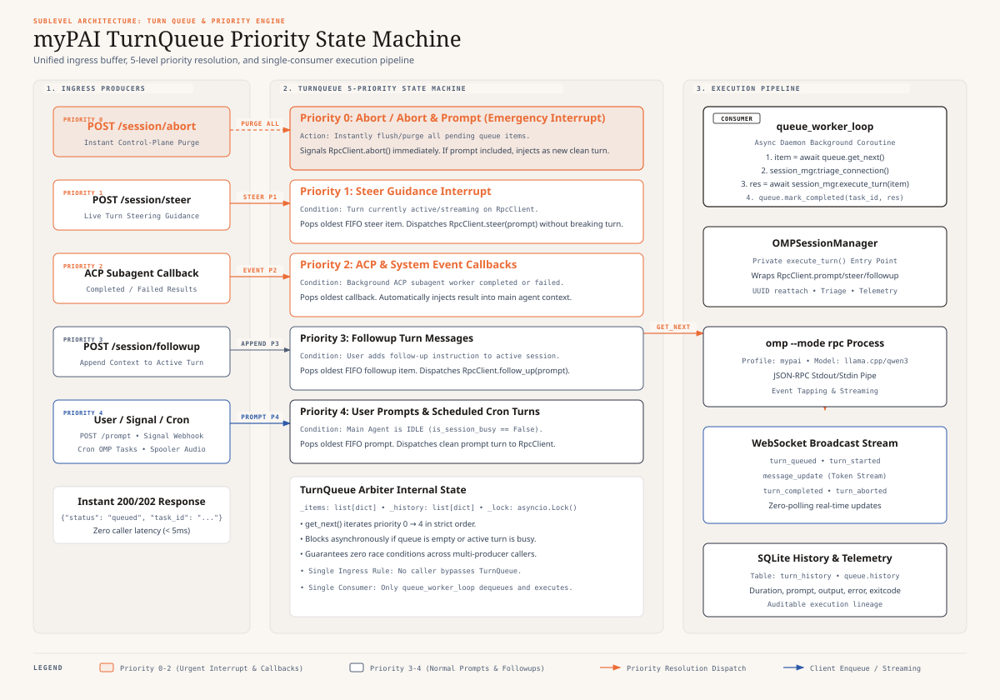
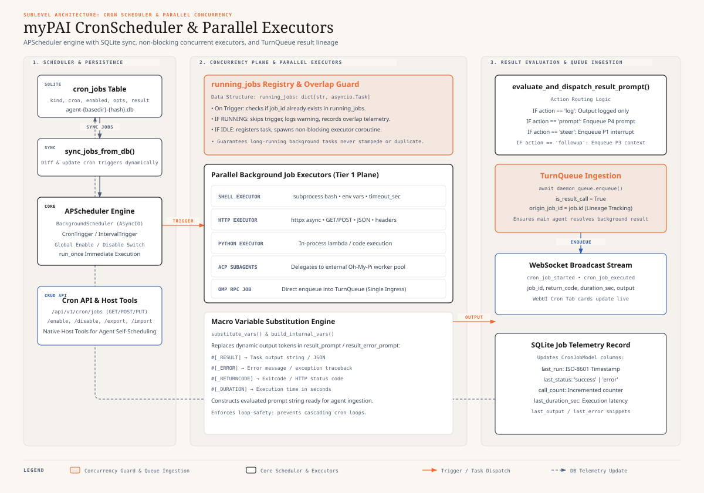
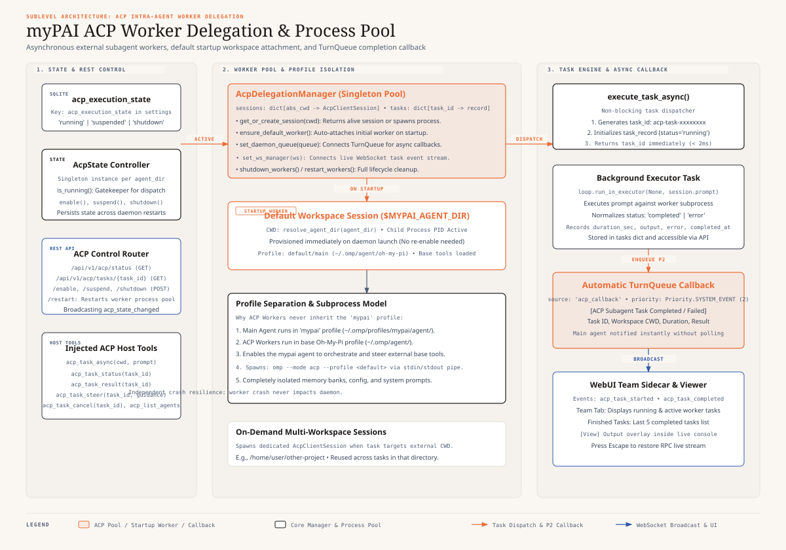

# MyPAI Daemon Core Architecture Specification (`daemon-spec.md`)

## Executive Summary

The **MyPAI Daemon** (`mypai_tools.daemon`) is the central background coordinator, RPC session manager, and turn serialization gateway for **MyPAI**. Running a **FastAPI** REST/WebSocket server and **APScheduler** engine on port `52080`, it maintains an active `omp --mode rpc` session in the target workspace.

It coordinates incoming requests from WebUI, Signal webhooks, Input Spooler sidecars, cron schedules, and ACP subagent workers via a decoupled **2-Tier Execution Architecture** (see [daemon-architecture.svg](daemon-architecture.svg) and [daemon-architecture.mermaid](daemon-architecture.mermaid)).


---

### 1. 2-Tier Execution Architecture & Single Ingress Rule

```
┌─────────────────────────────────────────────────────────────────────────────────┐
│                           2-TIER EXECUTION PLANE                                │
├─────────────────────────────────────────────────────────────────────────────────┤
│ 1. BACKGROUND EXECUTION PLANE (Parallel & Non-Blocking)                         │
│    • Shell Jobs, Python Jobs, HTTP Jobs                                         │
│    • ACP Worker Subprocesses (e.g. `omp --mode acp`)                            │
│    • Guarded by `running_jobs: dict[str, asyncio.Task]`                         │
│    • Concurrently executes non-OMP tasks; skips overlapping duplicate runs      │
│    • On completion with non-log action: Enqueues into Turn Queue                │
├─────────────────────────────────────────────────────────────────────────────────┤
│ 2. TURN QUEUE PLANE (Strictly Serialized for OMP RPC Session)                   │
│    • Human turns (Web UI / API)                                                 │
│    • Scheduled OMP cron turns                                                   │
│    • Signal webhook notifications                                               │
│    • Background Executor Results (`is_result_call=True`)                        │
│    • ACP Subagent Completion Callbacks (`source="acp_callback"`, priority=2)    │
│    • Resolved by strict priority-flush state machine before OMP dispatch        │
└─────────────────────────────────────────────────────────────────────────────────┘
```

### The Single Ingress Rule: Always Enqueue, Never Direct Call
- **100% of all turn inputs** (WebUI, Signal, Cron, ACP callbacks, Spooler, Result dispatchers) **must** enqueue into `TurnQueue`.
- No background task, executor, or API endpoint is permitted to call `OMPSessionManager.execute_turn()` directly.
- `OMPSessionManager.execute_turn()` is **strictly private to `queue_worker_loop`**, eliminating race conditions and ensuring deterministic priority handling.
- **Control-Plane Exception**: `POST /api/v1/session/abort` acts as an **Instant Control-Plane Interrupt**. It instantly purges all pending turns from `TurnQueue` and signals `session_mgr.abort()`, stopping execution without waiting for queue ticks.

---

## 2. Turn Queue Priority-Flush State Machine



When resolving the next action to execute on the persistent `omp_rpc` session:

1. **Rule 1 (Abort Priority & Queue Flush)**:
   - If any `abort` or `abort_and_prompt` event exists in the Turn Queue:
   - **Immediately drop/purge all pending items from the Turn Queue.**
   - Dispatch the abort or abort_and_prompt action to `omp_rpc`.
2. **Rule 2 (Steer Priority)**:
   - If any `steer` items are in the queue:
   - Pop the oldest (FIFO) `steer` item and dispatch immediately to `omp_rpc.steer()`.
3. **Rule 3 (System & ACP Callback Priority)**:
   - If any `system_event` or `acp_callback` items are in the queue:
   - Pop the oldest (FIFO) item (priority 2) to inform the main agent of subagent task completions.
4. **Rule 4 (Followup Priority)**:
   - If any `followup` items are in the queue:
   - Pop the oldest (FIFO) `followup` item and dispatch to `omp_rpc.follow_up()`.
5. **Rule 5 (Prompt Idle Priority)**:
   - Check if the OMP RPC turn is currently running / busy.
   - If **idle**: Pop the oldest (FIFO) `prompt` (or result prompt) and dispatch to `omp_rpc.prompt()`.
   - If **busy**: Wait until the active turn concludes.

---

## 3. Concurrency & Overlapping Job Prevention



- **`running_jobs` Registry**: `mypai_daemon.scheduler` maintains a dictionary mapping `job_id -> asyncio.Task`.
- **Policy**: When a cron trigger fires for a job currently in `running_jobs`:
  - The trigger is **skipped** (not queued).
  - A notice is logged and recorded in telemetry.
- **Lineage & Loop Safety**:
  - Executor results with `result.action` $\neq$ `log` enqueue with `is_result_call=True` and `origin_job_id=job_id`.
  - Result turns cannot trigger downstream cron jobs or recurse into event loops.
  - OMP-kind cron tasks restrict `result.action` to `log`.

---

## 4. OMP Session Manager (`mypai_daemon.session_manager`)

* **Role**: Dedicated low-level driver for the `omp --mode rpc` child process and host tool provider.
* **Process Isolation**: Spawns and supervises the child process, recovers on connection loss (`triage_connection`).
* **Profile Property**: Read-only property returning `os.getenv("OMP_PROFILE", "mypai")`.
* **Session UUID Persistence**: Reattaches to existing session via `--profile <profile> --resume <session_uuid>` or initializes a new session, persisting `session_uuid` in DB.
* **Session Title**: Automatically set to `"mypai_daemon - running"`.
* **Native Host Tools**: Directly registers Cron Host Tools and ACP Host Tools via `rpc_client.set_custom_tools()`.
* **Execution Privacy**: `execute_turn()` is only ever called by `queue_worker_loop`. All external callers interact exclusively via `TurnQueue.enqueue()`.

---

## 5. ACP Worker Subagent Process Pool



- See [acp-tool-spec.md](acp-tool-spec.md) for full protocol details.
- Workers run in base/main Oh-My-Pi profile (`~/.omp/agent/`) by default and auto-attach to `$MYPAI_AGENT_DIR` on startup.
- On completion, results automatically enqueue into `TurnQueue` at Priority 2.

---

## 6. Signal Whitelist Filtering (`mypai_tools.signal_client`)

- **`SIGNAL_ACCOUNT`**: Local account phone number.
- **`SIGNAL_ALLOWED_SENDER`**: Whitelisted sender phone number. Messages from other senders are dropped immediately.
- Enqueues notification turn into `TurnQueue`: `"📬 NEW Signal message received from {sender}. Use 'chat_mcp.get_next_unread_message' to read."`