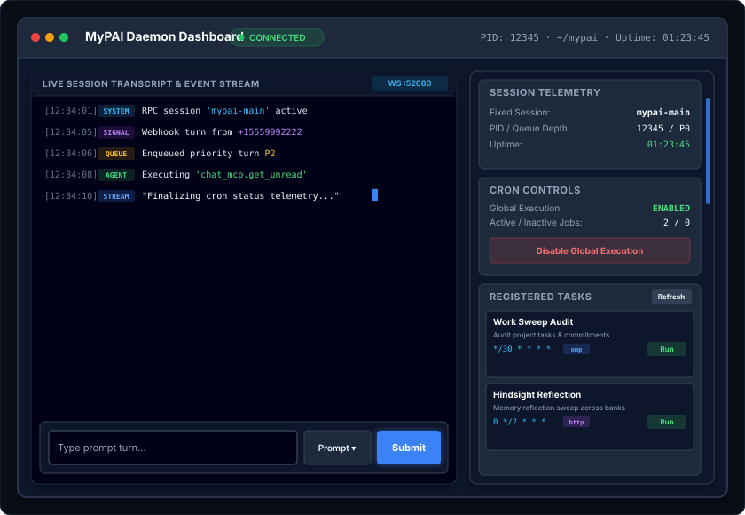

# MyPAI Embedded Single-Page WebUI Specification (`web-ui-spec.md`)

## Executive Summary

`mypai_daemon` embeds a responsive, dark-mode **Glassmorphism Single-Page Application (SPA)** served directly by FastAPI at `/` or `/ui`. It requires **zero Node.js build pipeline** at runtime and connects to `mypai_daemon` via HTTP REST (`/api/v1`) and WebSockets (`/api/v1/ws`).

---

## 1. User Interface Layout & Components

> 💡 *Interactive / Standalone HTML version available at [`webui-layout.html`](webui-layout.html).*

---

## 2. Component Specifications

### 2.1 Header & Status Indicator
- **Brand Title**: Displays `myPAI Console` title.
- **WebSocket Connection Status**: Positioned directly after `myPAI Console`, showing real-time WebSocket stream state: `Connected` (green pulsing dot) or `Disconnected` (red dot).
- **Header Controls**:
  - **Sidebar Toggle**: Positioned on the right header bar (`▶ Sidebar`), expanding/collapsing the right sidebar panel with layout persistence in `localStorage`.
  - **Global Refresh Button**: Positioned at the far right of the header bar (`Refresh`). Clicking it triggers an immediate full reload of all sidebar cards and telemetry (`reloadStatsAndSidecars()`).

### 2.2 Transcript & Log Stream
- Subscribes to `WS /api/v1/ws`.
- **Automatic History Restoration**: Queries `GET /api/v1/session/history` on load or when clicking **Reload History** (calling `loadSessionHistory(true)`) to clear and restore past turn prompts and complete assistant outputs.
- **Task Input Display**: Logs incoming task prompts as distinct `[Task Input]` entries upon `turn_started` WebSocket events.
- **In-Place Live Stream Activity Ticker**: Receives real-time text updates (`message_update`). Instead of appending hundreds of separate chunk lines, updates a single in-place active ticker (`[Stream Active (1,420 chars)] ... <latest chunk preview>`).
- **Stream Chunks Toggle**: Includes **Show Stream Chunks** toggle checkbox (persisted via `localStorage`). Intermediate streaming deltas update the active ticker when enabled; when completed, the full output (`[Output]`) is rendered cleanly.
- Includes quick-action controls: **Reload History**, **Clear Console**, **Show Stream Chunks**, and **Show Events** filter toggle.

### 2.3 Interactive Control Line
- **Input Textarea**: Allows human operator to type prompts directly into the active `omp` session.
- **Mode Selector**:
  - `prompt`: Submits standard turn (`POST /api/v1/session/prompt`).
  - `steer`: Submits high-priority interrupt (`POST /api/v1/session/steer`).
  - `followup`: Appends followup turn (`POST /api/v1/session/followup`).
  - `abort_and_prompt`: Aborts active turn and queues new prompt (`POST /api/v1/session/abort_and_prompt`).

### 2.4 Scrollable Sidebar Telemetry & Registered Cron Tasks
- **Collapsible Sidebar**: Dynamic grid layout with smooth collapsing toggle and layout state persistence (`localStorage`).
- **Independent Scrollbar**: `<aside>` has a maximum height (`calc(100vh - 120px)`) with independent `overflow-y: auto` scrolling and a custom smooth dark scrollbar.
- **DOM Null-Safety**: All telemetry updater functions (`updateStatus()`, `updateStats()`, `updateAcpStatus()`) use strict null-checks for DOM elements (`if (el) ...`) so missing elements never halt execution.
- **Card 1: Daemon RPC** (renamed from *RPC Connection & Active Call*):
  - Displays RPC Connection Status (`Connected` / `Disconnected`), **Daemon Profile** (`mypai` / `OMP_PROFILE`), daemon process PID, uptime counter, and turn queue depth.
  - **CURRENTLY RUNNING RPC CALL Box**: Displays active turn ID, execution mode, running profile name, duration counter, and prompt snippet.
  - Action buttons: **Reconnect** (`POST /api/v1/session/reconnect`) and **Abort** (`POST /api/v1/session/abort`).
- **Card 2: Session** (merged *Session State* and *Session Stats & Cost*, placed directly under *Daemon RPC*):
  - Displays Session Name (`tel-session`).
  - **Dedicated Session UUID Layout**: Formatted as a full-width monospace block (`word-break: break-all; user-select: all; font-size: 0.78rem`) inside a dark container box with label `SESSION UUID` to prevent font/layout distortion.
  - Displays Steering / Streaming mode (`one-at-a-time` / `no`), User / Assistant Message Counters (`stats-user-msgs` / `stats-asst-msgs`), Tool Calls / Results (`stats-tool-calls` / `stats-tool-results`), Input / Output / Total Token usage, Estimated Cost ($0.0000), and Context Window Usage progress bar.
- **Card 3: Tasks** (renamed from *Cron Tasks & Telemetry*):
  - Card Header Action buttons: **Export** (`GET /api/v1/cron/export` JSON download) and **Import** (`POST /api/v1/cron/import` JSON upload).
  - Displays global execution state (`Enabled` / `Disabled`), total registered jobs count, active vs inactive job counts.
  - **Global Task Toggle Button**: Interactive button labeled **Disable all Tasks** / **Enable all Tasks** calling `POST /api/v1/cron/disable` or `POST /api/v1/cron/enable`.
  - **Registered Tasks Table**: Queries `GET /api/v1/cron/jobs` on load. Displays task titles, descriptions, 5-field cron schedules, kind badges, call metrics, and one-click **Run Now** buttons (`POST /api/v1/cron/jobs/run_once`).
- **Card 4: External Agents** (renamed from *ACP Process Control* / *Agent Worker*, placed last):
  - Displays ACP state badge (`RUNNING` / `STOPPED`), **Process PID** (`acp-pid`), **Uptime** (`acp-uptime`), active worker processes count, and total task count.
  - Scrollable worker process list displaying PID, CWD workspace, and uptime per worker.
  - Action buttons: **Shutdown / Disable** (`POST /api/v1/acp/shutdown`) and **Restart / Enable** (`POST /api/v1/acp/restart`).

### 2.5 Background Polling & Event-Driven Telemetry Sync
- **Background HTTP Polling**: Non-WebSocket background HTTP polling for status and telemetry (`updateStatus`, `updateAcpStatus`, `updateStats`, `updateCronStatus`) runs every **30 seconds** (`30,000ms`).
- **Event-Driven Signal Sync**: Automatically triggers an immediate full reload of all sidebar telemetry (`reloadStatsAndSidecars()`) upon receiving `queue_updated`, `turn_started`, `turn_completed`, or any of the 12 RPC daemon lifecycle WebSocket events (`rpc_agent_start`, `rpc_agent_end`, `rpc_turn_start`, `rpc_turn_end`, `rpc_message_start`, `rpc_message_end`, `rpc_tool_execution_start`, `rpc_tool_execution_end`, `rpc_auto_compaction_start`, `rpc_auto_compaction_end`, `rpc_auto_retry_start`, `rpc_auto_retry_end`).
